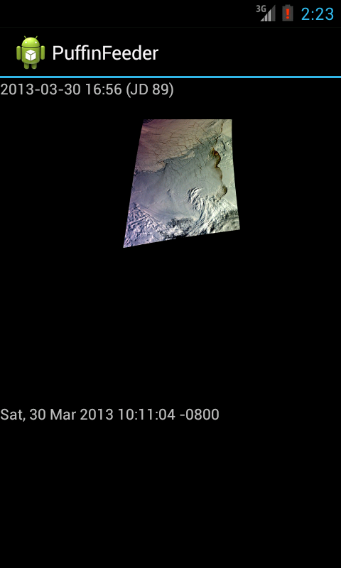

# GINA Puffin Viewer for Android
This is a quick and dirty android implementation of this:

http://feeder.gina.alaska.edu/

# Building
* Get IntelliJ IDEA
* Get it set up with the latest Android SDK
* Load the project
* Build and Run!

This has been tested on a Nexus 7 tablet, but should be compatible with nearly
all android devices.  Some work needs to be done to bring this app to
production level, but the proof of concept (reading the RSS feed, displaying
images and happy zoom mode) is there.  

  

